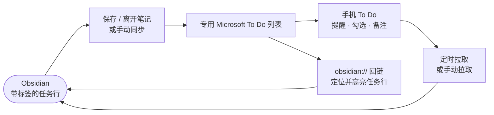
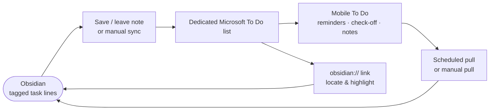

# MS To Do Sync

[中文](#中文文档) | [English](#english-documentation)

<div align="center">


</div>

---

## 中文文档

### 插件介绍

如果你希望 **在 Obsidian 里规划任务，在手机上用 Microsoft To Do 执行**，可以试试 MS To Do Sync。

它适合：用 Markdown 任务清单管理学习/工作、又需要手机提醒与勾选的人；只想同步「明确标记」的任务、不想把整个 To Do 账号搬进库的人；需要把任务备注、一层子步骤一并带到 To Do 的人；在 To Do 里点一下就能回到 Obsidian 对应任务行的人。

上手很轻：给任务加上同步标签（默认 `#mtd-sync`），保存笔记，任务会进入你配置的 **专用 Microsoft To Do 列表**。在手机上勾选完成、改标题或写备注，Obsidian 会按设定间隔拉回；你在库里改截止日期、备注或子任务，也会推送到 To Do。未打标签的任务 **永远不会** 被同步。

最低 Obsidian 版本：**1.11.4**

## 核心能力

- **选择性同步**：仅同步带命名空间标签（含子标签）的任务，或你手动「同步当前任务」后建立映射的行
- **列表隔离**：只读写你配置的「Obsidian 主同步列表」及「专用同步列表」；其它 To Do 列表不会入站
- **双向字段**：标题、完成状态、截止日期（`📅`）、开始日期（`⏳`）、优先级（`⏫` / `🔼` / `🔽`）、进行中（`- [/]`）
- **备注与步骤**：任务下方缩进段落 → To Do 任务详情；一层缩进子 checkbox → To Do 步骤（Steps）
- **提醒与今日**：行尾 `reminder=` 同步到 To Do 提醒；`myday` 标记用「今日截止 + 提醒」替代（Graph 不支持字面「我的一天」）
- **入站捕获**：在已管理的 To Do 列表新建任务 → 自动写入库内默认笔记（如 `Microsoft To Do/Inbox.md`），并带上同步标签
- **子标签路由**：`#mtd-sync/工作` → 专用 To Do 列表 A → 默认落盘笔记 A；多项目可各走各的列表与文件
- **Obsidian 回链**：To Do 备注或关联项中可附加 `obsidian://mtd-sync?...`；点击后在 Obsidian 打开笔记并 **短暂高亮** 任务行
- **任务行云图标菜单**：推送、拉取、在 To Do 中打开、复制链接、停止同步
- **界面语言**：设置页支持 **中文 / English**（可跟随 Obsidian 自动选择）

## 典型工作流

下方图示概括「库内规划 ↔ 手机执行」的主路径（GitHub / Obsidian 均可渲染 Mermaid）。



### A. 在 Obsidian 写任务，到手机执行（最常用）

1. 打开 **设置 → MS To Do Sync → 账户**，在浏览器中登录微软账号。
2. 在 **常规 → 同步范围** 确认同步标签（默认 `mtd-sync`）与主列表名（默认 `Obsidian Sync`）。
3. 在任意笔记中写任务，例如：`- [ ] 复习第三章 #mtd-sync 📅 2026-06-20`
4. 保存或离开笔记后，任务出现在 To Do 对应列表；在手机上勾选完成，稍后会同步回 Obsidian 的 `- [x]`。

### B. 备注与子任务进 To Do

```markdown
- [ ] 准备组会 #mtd-sync 📅 2026-06-21

      带上上周实验数据
      确认会议室投影

  - [ ] 打印议程
  - [x] 发日历邀请
```

缩进段落进入 To Do **详情备注**；一层子 checkbox 进入 **步骤**。仅支持 **一层** 子任务（与 To Do Steps 能力一致）。

### C. 在 To Do 新建，回写到库（入站）

1. 在你配置的专用列表中新建任务。
2. 插件按 **默认入站笔记** 或 **子标签路由表** 中的路径，追加一行带 `#mtd-sync` 与内部 ID 的任务。
3. 若要在指定笔记落盘，可在 To Do 备注首行写 `[[笔记#标题]]` 或 `page: [[笔记#标题]]`，下一行 `---`，再写正文（详见设置说明）。

### D. 从 To Do 跳回 Obsidian

同步后，To Do 任务可附带 Obsidian 深链。在 To Do 中点击 **在 Obsidian 中打开**，会打开对应笔记、滚动到任务行并短暂高亮。任务行旁的云图标也可复制同一链接。

### E. 多列表 / 多笔记路由（可选）

在 **专用同步列表（子标签路由）** 中为子标签配置「To Do 列表 ↔ 默认库内笔记」。例如 `#mtd-sync/护理` → 列表「基础护理」→ `护理/任务.md`。适合按科目或项目拆分，而不把所有任务堆进一个列表。

## 任务写法速查

| 你在 Obsidian 写的 | 在 To Do 中的表现 |
|-------------------|------------------|
| `#mtd-sync`（或你改的标签名） | 准入同步；可用 `#标签/子标签` 走路由 |
| `📅 2026-06-20` | 截止日期 |
| `⏳ 2026-06-18` | 开始日期 |
| `⏫` `🔼` `🔽` | 高 / 中 / 低优先级 |
| `- [/]` | 进行中 |
| 任务下缩进段落 | 任务详情备注 |
| 一层 `- [ ]` 子项 | 步骤（Steps） |
| 行尾机器元数据注释 | 插件内部映射（阅读视图自动隐藏） |

> **说明**：任务行尾会写入 `mtd:id=…` 等形式的 HTML 注释元数据以保持双向映射；阅读模式下不会显示，也不会用可见的 `🆔` 污染任务正文。

## 安装

### 方式一：社区插件（推荐）

插件提交 Obsidian 官方审核后，可在 **设置 → 社区插件 → 浏览** 中搜索 **MS To Do Sync** 安装。

### 方式二：手动安装

1. 从 [GitHub Releases](https://github.com/zhuzhige123/obsidian-microsoft-todo-sync/releases) 下载与版本号一致的发布包，获取：
   - `main.js`
   - `manifest.json`
   - `styles.css`
2. 复制到库内 `.obsidian/plugins/ms-todo-sync/`
3. 重启 Obsidian，在 **设置 → 社区插件** 中启用 **MS To Do Sync**

## 快速开始

1. **登录**：设置 → **MS To Do Sync** → **账户** → **登录**，在浏览器完成微软授权后返回 Obsidian。
2. **确认范围**：**常规** 中设置同步标签、主 To Do 列表名、入站默认笔记路径。
3. **写一条任务**：在笔记中加入 `#mtd-sync`（或你的标签），保存。
4. **检查 To Do**：打开手机或桌面 Microsoft To Do，在专用列表中查看是否出现任务。
5. **命令面板**（可选）：`同步全部带标签任务`、`同步当前笔记中的任务`、`拉取远程任务更改` 等。

任务行旁的 **云图标** 可对单条任务推送、拉取、打开 To Do 或停止同步。

## 数据、同步与隐私

**建议随库同步（位于 Vault）**：你的 Markdown 任务、备注与子任务——它们本来就是库内容，会随 Obsidian Sync / iCloud / 网盘等策略在多端一致。

**保存在插件目录（通常不需手抄）**：登录令牌（`secretStorage`）、同步索引等运行状态。换设备后重新登录即可。

**网络访问**：插件通过 Microsoft Graph 与你的 To Do 账号通信，用于登录、推送与拉取任务。**不会** 把你的整库笔记上传到第三方；仅传输与已映射任务相关的字段。

## 常见问题

### 任务没有出现在 To Do？

确认任务行带有 **同步标签**（默认 `#mtd-sync`），且已 **登录** 微软账号。检查设置中的列表名是否与 To Do 中一致。可尝试命令 **同步当前笔记中的任务** 或 **同步全部带标签任务**。

### 会不会同步我 To Do 里的全部任务？

**不会。** 只有 **Obsidian 主同步列表** 和你在路由表里配置的 **专用列表** 会参与入站；其它列表中的任务不会被拉入库。

### 在 To Do 勾选完成，Obsidian 会怎样？

对应行会变为 `- [x]`；阅读视图中显示为已完成样式。默认 **不会** 因「完成」而删除任务行（与「在 To Do 永久删除」不同，后者可在设置里选择删行 / 仅取消同步 / 保留）。

### 能否不用标签，同步所有任务？

**不能。** 本插件的设计就是 **选择性同步**，避免把整个库或整个 To Do 账号绑在一起。可对单条任务使用命令 **同步当前任务行** 自动加标签并建立映射。

### 支持「我的一天」吗？

Microsoft Graph **不提供** To Do「我的一天」读写接口。可用命令 **加入今日（截止 + myday）** 或 `myday` 标记，以 **今日截止 + 提醒** 达到类似效果。

### 点击 To Do 里的 Obsidian 链接没反应？

请确认 Obsidian 已打开且库名一致；桌面端一般可直接唤起。若链接无效，可在 Obsidian 中对任务使用 **复制 Obsidian 任务链接** 检查是否已建立映射。

### 与 Weave / EPUB 阅读器的关系？

**无依赖。** MS To Do Sync 是独立插件，不安装 Weave 系列其它插件也可使用。

### 插件文件夹名称？

插件 ID：`ms-todo-sync` → `.obsidian/plugins/ms-todo-sync/`

## 反馈与支持

- **问题反馈**：[GitHub Issues](https://github.com/zhuzhige123/obsidian-microsoft-todo-sync/issues)
- **作者**：Rabbit (zhuzhige) · https://github.com/zhuzhige123

## 许可证

源码基于 [GPL-3.0-or-later](LICENSE) 发布。

---

## English Documentation

### Introduction

If you want to **plan tasks in Obsidian and execute them in Microsoft To Do on your phone**, MS To Do Sync is built for that workflow.

It fits people who keep task lists in Markdown but rely on To Do for reminders and mobile check-off; who only want **explicitly tagged** tasks synced—not an entire To Do account; who need notes and one level of sub-steps in To Do; and who want a tap in To Do to jump back to the exact task line in Obsidian with a short highlight.

Getting started is light: add a sync tag (default `#mtd-sync`) to a task and save—the task lands in your configured **dedicated Microsoft To Do list**. Complete, rename, or annotate on your phone and changes pull back on a schedule; edit due dates, notes, or subtasks in your vault and they push to To Do. Tasks **without** the tag are **never** synced.

Minimum Obsidian version: **1.11.4**

## Core capabilities

- **Selective sync**: Only tasks with your namespace tag (including sub-tags), or lines you explicitly sync via command
- **List isolation**: Reads/writes only your main Obsidian sync list and configured dedicated lists—other To Do lists are ignored for inbound capture
- **Two-way fields**: Title, completion, due date (`📅`), start date (`⏳`), priority (`⏫` / `🔼` / `🔽`), in-progress (`- [/]`)
- **Notes and steps**: Indented paragraphs under a task → To Do body; one level of indented sub-checkboxes → To Do checklist steps
- **Reminders and “today”**: `reminder=` in metadata syncs to To Do reminders; `myday` uses **due today + reminder** (Graph has no literal My Day API)
- **Inbound capture**: New tasks in managed lists append to a default vault note (e.g. `Microsoft To Do/Inbox.md`) with the sync tag applied
- **Sub-tag routing**: e.g. `#mtd-sync/work` → dedicated list A → default vault file A
- **Obsidian deep links**: Optional `obsidian://mtd-sync?...` in To Do notes or linked resources—opens the note and **briefly highlights** the task line
- **Task-line cloud menu**: Push, pull, open in To Do, copy link, stop syncing
- **UI language**: Settings in **English / 中文** (can follow Obsidian automatically)

## Typical workflows

The diagram below shows the main **vault planning ↔ mobile execution** loop (Mermaid renders on GitHub and in Obsidian).



### A. Write in Obsidian, execute on your phone (most common)

1. Open **Settings → MS To Do Sync → Account** and sign in with your Microsoft account in the browser.
2. Under **General → Sync scope**, confirm the sync tag (default `mtd-sync`) and main list name (default `Obsidian Sync`).
3. Write a task, e.g. `- [ ] Review chapter 3 #mtd-sync 📅 2026-06-20`
4. After save or leaving the note, the task appears in To Do; check it off on your phone and Obsidian updates to `- [x]` after the next pull.

### B. Notes and subtasks in To Do

```markdown
- [ ] Prepare team meeting #mtd-sync 📅 2026-06-21

      Bring last week's experiment data
      Confirm projector in the room

  - [ ] Print agenda
  - [x] Send calendar invite
```

Indented paragraphs become the To Do **task body**; one level of sub-checkboxes becomes **steps**. Only **one** nesting level is supported (matching To Do).

### C. Create in To Do, capture into the vault (inbound)

1. Create a task in a managed dedicated list.
2. The plugin appends a tagged line with an internal ID to your **default inbound note** or a **route table** target file.
3. To target a specific note, put `[[Note#Heading]]` or `page: [[Note#Heading]]` on the first line of the To Do body, then `---`, then the text (see in-plugin settings).

### D. Jump from To Do back to Obsidian

After sync, tasks can include an Obsidian deep link. Tap **Open in Obsidian** in To Do to open the file, scroll to the line, and flash-highlight it. The cloud icon on the task line can copy the same link.

### E. Multi-list / multi-note routing (optional)

In **Dedicated sync lists (sub-tag routes)**, map sub-tags to a To Do list and default vault path—useful when splitting courses or projects instead of one giant list.

## Task syntax cheat sheet

| In Obsidian | In Microsoft To Do |
|-------------|-------------------|
| `#mtd-sync` (or your tag) | Eligible for sync; `#tag/subtag` for routing |
| `📅 2026-06-20` | Due date |
| `⏳ 2026-06-18` | Start date |
| `⏫` `🔼` `🔽` | High / normal / low importance |
| `- [/]` | In progress |
| Indented paragraphs under the task | Task body notes |
| One level of `- [ ]` sub-items | Checklist steps |
| Trailing machine metadata comment | Internal mapping (hidden in reading view) |

> **Note**: The plugin stores mapping as an HTML comment with `mtd:id=…` (and related fields) at the end of the line. Reading view hides it—no visible `🆔` clutter in your task text.

## Installation

### Option 1: Community plugins (recommended)

Once listed in the official directory, open **Settings → Community plugins → Browse** and search for **MS To Do Sync**.

### Option 2: Manual installation

1. Download a [GitHub release](https://github.com/zhuzhige123/obsidian-microsoft-todo-sync/releases) matching the version in `manifest.json`:
   - `main.js`
   - `manifest.json`
   - `styles.css`
2. Copy into `.obsidian/plugins/ms-todo-sync/`
3. Restart Obsidian and enable **MS To Do Sync** under **Settings → Community plugins**

## Quick start

1. **Sign in**: Settings → **MS To Do Sync** → **Account** → **Sign in**, complete Microsoft auth in the browser, return to Obsidian.
2. **Confirm scope**: Set sync tag, main To Do list name, and default inbound note path under **General**.
3. **Add a task**: Include `#mtd-sync` (or your tag) in a task line and save.
4. **Check To Do**: Open Microsoft To Do on phone or desktop and look in your dedicated list.
5. **Command palette** (optional): *Sync all tagged tasks*, *Sync tasks in current note*, *Pull remote task changes*, etc.

Use the **cloud icon** on a task line to push, pull, open in To Do, or stop syncing that line only.

## Data, sync, and privacy

**Good to sync (in the vault)**: Your Markdown tasks, notes, and subtasks—they are vault content and follow Obsidian Sync / iCloud / cloud vault setups.

**Usually local (plugin folder)**: Sign-in tokens (`secretStorage`), sync index, and runtime state. Sign in again on a new device.

**Network**: The plugin talks to Microsoft Graph for your To Do account—sign-in, push, and pull. It does **not** upload your entire vault; only fields for mapped tasks are transmitted.

## FAQ

### Task not showing in To Do?

Confirm the line has the **sync tag** (default `#mtd-sync`) and you are **signed in**. Check that the list name in settings matches To Do. Try **Sync tasks in current note** or **Sync all tagged tasks** from the command palette.

### Will all my To Do tasks sync into Obsidian?

**No.** Only the **main Obsidian sync list** and **dedicated lists** in your route table participate in inbound capture.

### I checked off a task in To Do—what happens in Obsidian?

The line becomes `- [x]` with completed styling in reading view. **Completing** does not delete the line by default (unlike **permanent delete** in To Do, which you can map to delete / unlink / keep in settings).

### Can I sync every task without tags?

**No.** This plugin is intentionally **selective**. Use **Sync current task line** to tag and link a single line on demand.

### Does it support My Day?

Microsoft Graph does **not** expose read/write for To Do My Day. Use **Add to today (due + myday)** or a `myday` marker for **due today + reminder** instead.

### Obsidian link from To Do does nothing?

Keep Obsidian open with the correct vault. If the link is invalid, use **Copy Obsidian task link** on the task line in Obsidian to verify mapping exists.

### Relation to Weave / EPUB Reader?

**No dependency.** MS To Do Sync is a standalone plugin.

### Plugin folder name?

Plugin ID: `ms-todo-sync` → `.obsidian/plugins/ms-todo-sync/`

## Feedback and support

- **Issues**: [GitHub Issues](https://github.com/zhuzhige123/obsidian-microsoft-todo-sync/issues)
- **Author**: Rabbit (zhuzhige) · https://github.com/zhuzhige123

## License

Source code is released under [GPL-3.0-or-later](LICENSE).
